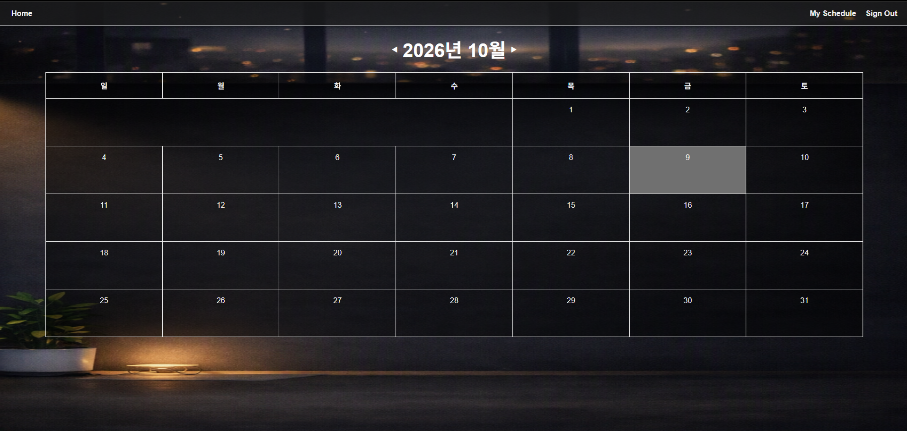

# 일정 관리 웹페이지

일정을 월별 캘린더로 관리하는 임효성의 웹페이지입니다.

**배포 링크**: https://calendar-site-nine.vercel.app/
**테스트 계정**: [test@test.com / test123]



---

## 기술스택

- **Next.js 16 / React 19 / TypeScript**
- **CSS Module / Styled-Components**
- **react-hook-form / zod**
- **Supabase**
- **Vercel**

---

## 프로젝트 구조

```
/
├── app/
│   ├── (home)                          # 메인 페이지
│   ├── (route)                         # 일정 수정/작성, 내일정, 로그인/회원가입
│   ├── component                       
│   │   ├── auth                        
│   │   │   ├── auth.tsx                # 회원가입/로그인/로그아웃
│   │   │   └── supabaseClient.tsx      # supabase db 연동
│   │   ├── calendar
│   │   │   ├── calendar.tsx            # 캘린더 그리드
│   │   ├── loginout
│   │   │   ├── githubButton.tsx        # 깃허브 로그인
│   │   ├── navigation.tsx              # 내비게이션
│   ├── style                           # css module
│   ├── layout.tsx                      # 전체 레이아웃
├── public                              # 정적 파일
```

---

## 주요기능

- 회원가입(이메일 인증) / 로그인 / 로그아웃
- 캘린더 이동 및 오늘 일자 표기(하이라이트)
- 캘린더 작성·수정·삭제 (이전일자 작성 불가 및 자동 삭제)
- 깃허브 소셜 로그인

---

## 실행방법

```
# 패키지 설치
npm install

# 환경변수 설정
최상위 경로에 있는 .env.example 참고하여 .env.local 작성

# 개발 서버 실행(localhost:3000)
npm run dev
```